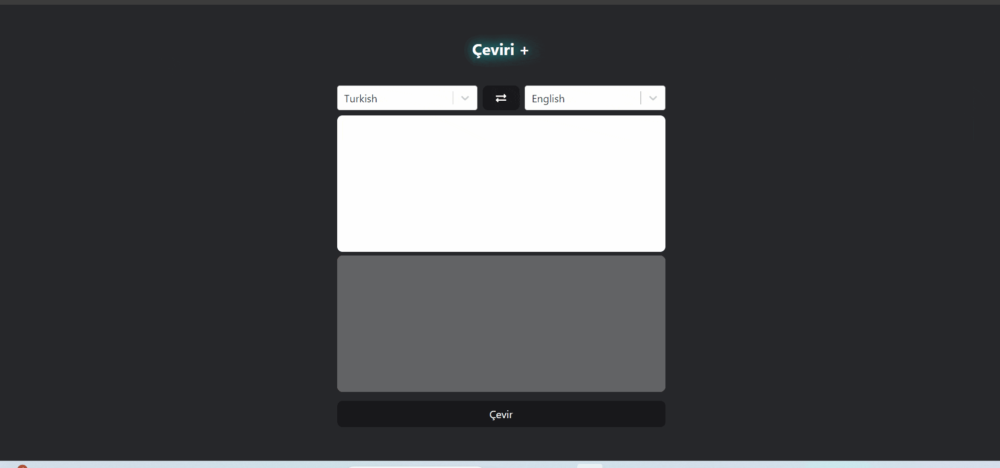

# Translation App

This is a simple translation application built using React and Redux with Redux Toolkit. It utilizes React Redux for state management and Axios for making HTTP requests. Additionally, it employs React Select for user-friendly dropdowns and Tailwind CSS for styling.

## Features

- Translate text from one language to another
- User-friendly interface with dropdown selection
- Responsive design with Tailwind CSS

## Project gif

